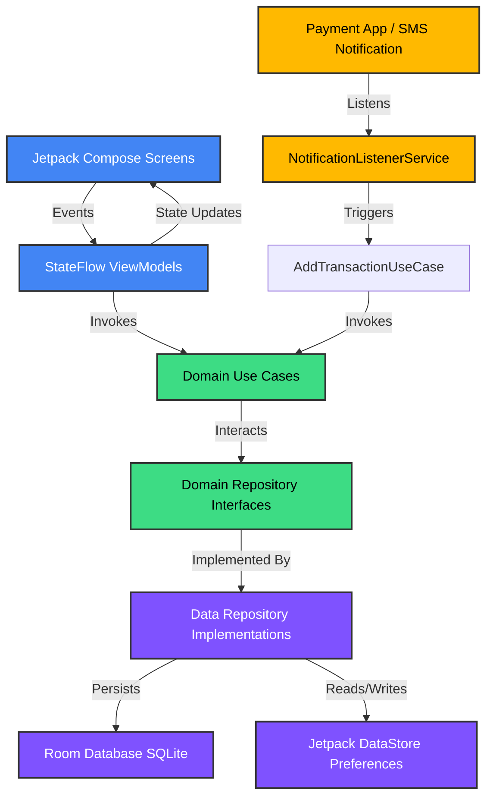

# CredenceAI 🪙

**CredenceAI** is a premium, privacy-first personal finance manager for Android. By leveraging on-device intelligence, it automatically intercepts and parses financial notification streams (from UPI apps, digital wallets, and bank SMS alerts) to log expenses in real time, eliminating the high friction and abandonment rates of manual logging.

---

<p align="center">
  
</p>

<p align="center">
  <a href="https://kotlinlang.org/"></a>
  <a href="https://developer.android.com/jetpack/compose"></a>
  <a href="https://dagger.dev/hilt/"></a>
  <a href="https://developer.android.com/training/data-storage/room"></a>
  <a href="LICENSE"></a>
</p>

---

## 📖 Table of Contents

- [🚀 Product Vision](#-product-vision)
- [✨ Core Capabilities](#-core-capabilities)
- [🏗️ Architectural Architecture & Principles](#-architectural-architecture--principles)
- [🛠️ Technical Stack & Tooling](#%EF%B8%8F-technical-stack--tooling)
- [🧬 Smart Notification Parsing Engine](#-smart-notification-parsing-engine)
- [📂 Project Package Mapping](#-project-package-mapping)
- [🚀 Quick Start & Build Configuration](#-quick-start--build-configuration)
- [📈 Future Roadmap](#-future-roadmap)
- [🤝 Let's Connect](#-lets-connect)

---

## 🚀 Product Vision

Over 90% of users abandon personal finance tracking apps within the first month due to "input fatigue." **CredenceAI** solves this friction entirely. It acts as an autonomous background listener that maps incoming notification texts to a single-source-of-truth Room database. 

- **Zero-Touch Expense Logging:** Real-time background parser of UPI platforms (Google Pay, PhonePe, Paytm), retail wallet notifications, and official bank SMS feeds.
- **Strictly Local & Offline:** To ensure absolute privacy, there are no remote servers. All text analysis, categorizations, and database updates occur directly on the device.
- **Smart Budget Planning:** Allocates monthly financial targets dynamically, showing clear progress indicators, alerts, and categorizations.

---

## ✨ Core Capabilities

*   **Background Ingestion Pipeline:** Uses a lightweight `NotificationListenerService` that filters out system notification noise, ensuring minimum wake-ups and maximum battery optimization.
*   **Indian Fintech Ecosystem Support:** Built-in multi-pass Regex engine optimized for the unique formatting patterns of Indian payment services and banking alerts.
*   **Interactive Financial Dashboard:** Combines Month Summary metrics (Income vs. Spent) with a fluid, visual progress representation of monthly budget allocation.
*   **Flexible CSV Export:** Compiles database transactions and generates standard CSV reports to share or backup for external audits.
*   **Secure Settings Management:** Integrated preferences for app theme, language customizers, backup & restore configurations, app locks, and tracking controls via Jetpack DataStore.

---

## 🏗️ Architectural Architecture & Principles

CredenceAI is constructed using **Clean Architecture** patterns combined with a reactive unidirectional data flow (UDF) using Jetpack Compose and **MVI/MVVM** state management.

### Architecture Layer Overview



### Architectural Pillars:
- **Presentation Layer (100% Compose):** Uses ViewModels emitting immutable state objects (`StateFlow`). State flows down, events flow up. Lifecycle-aware collection ensures zero database connections leak when the app backgrounded.
- **Domain Layer:** Pure Kotlin implementation containing model representations (`Transaction`, `Budget`) and business Use Cases. Totally isolated from Android SDK dependencies to guarantee unit-testability.
- **Data Layer:** The structural layer that handles database schemas, DAOs, reactive configuration mappings, preference serialization, and the local Room implementation.

---

## 🛠️ Technical Stack & Tooling

| Technology | Reference Version | Role in Project |
| :--- | :--- | :--- |
| **Kotlin** | `2.1.0` | Core programming language with JVM Toolchain version 17. |
| **Jetpack Compose** | `BOM 2024.12.01` | Dynamic UI elements with standard Material3 themes. |
| **Dagger Hilt** | `2.59.2` | Clean dependency injection container with Jetpack Navigation integration. |
| **Room DB** | `2.7.0-alpha11` | Local structured SQLite database management compiled with Google KSP. |
| **Jetpack DataStore** | `1.1.2` | Reactive transactional settings/preferences management. |
| **Timber** | `5.0.1` | Automated, utility-based debugger logs. |
| **Gradle (Kotlin DSL)** | `9.1.0 (AGP)` | Modern build management and dependency catalogs. |

---

## 🧬 Smart Notification Parsing Engine

The core utility of the ingestion framework lies in the `TransactionNotificationListener`. It registers package filters to avoid consuming unnecessary processor cycles and handles standard transaction messages using state-of-the-art rules:

1. **Package Validation:** Monitors specific financial applications (e.g., Google Pay, PhonePe, BHIM, Paytm, CRED) or system SMS messengers.
2. **Title Pattern Identification:** Matches incoming notification handles against registered VM-XXXXX and AX-XXXXX Indian TRAI bank alphanumeric sender codes.
3. **Keyword Parsing Hierarchy:**
   - **Debits:** Matches patterns containing `debited`, `spent`, `withdrawn`, `payment of`, `you paid`, or `you sent`.
   - **Credits:** Matches patterns containing `credited`, `received`, `cashback`, `deposited`, or `transferred to you`.
   - **Spam Filtering:** Drops OTP alerts, password reminders, login validations, and standard discount/offer promotions instantly.
4. **Amount Extraction Regex:**
   ```kotlin
   // Captures ₹1,250.00, INR 500, Rs. 200, etc.
   val AMOUNT_REGEX = Regex(
       """(?:₹|Rs\.?\s*|INR\s*)([\d,]+(?:\.\d{1,2})?)""",
       RegexOption.IGNORE_CASE
   )
   ```

### Supported Financial Packages

| UPI / Payments Apps | Supporting Bank Apps | SMS Sender Formats |
| :--- | :--- | :--- |
| Google Pay (`com.google.android.apps.nbu.paisa.user`) | HDFC Bank MobileBanking (`com.snapwork.hdfc`) | `HDFCBK` |
| PhonePe (`com.phonepe.app`) | ICICI iMobile (`com.csam.icici.bank.imobile`) | `ICICIB` |
| BHIM UPI (`in.org.npci.upiapp`) | SBI YONO (`com.sbi.SBIFreedomPlus`) | `SBIINB` |
| CRED (`com.dreamplug.androidapp`) | Kotak Mahindra Mobile (`com.msf.kbank.mobile`) | `KOTAKB` |
| Paytm (`net.one97.paytm`) | Axis Mobile (`com.axis.mobile`) | `AXISBK` |

---

## 📂 Project Package Mapping

```text
com.credenceai.app
 ├── core                  # Common preferences, utility managers, data exporters
 ├── data
 │    ├── local            # Room Database, Category/Transaction Entities, and DAOs
 │    ├── mapper           # DTO to domain model converters
 │    ├── notification     # Background NotificationListenerService & Regex Engine
 │    └── repository       # Concrete repository implementations mapping DB access
 ├── di                    # Hilt modules injecting Database, Preference, and UseCase modules
 ├── domain
 │    ├── model            # Pure model definitions (Transaction, Budget)
 │    ├── repository       # Abstract repository interfaces for testing isolation
 │    └── usecase          # Individual class-based business logics (AddTransaction, Export, etc.)
 └── presentation
      ├── navigation       # Dynamic routing definitions & Compose NavGraph configurations
      ├── state            # UI State representations
      └── ui
           ├── components  # Custom UI cards, sliders, and progress loaders
           ├── screens     # Jetpack Compose layouts (HomeScreen, SettingsScreen, EditBudgetScreen)
           └── theme       # Brand palettes, font typographies, and color systems
```

---

## 🚀 Quick Start & Build Configuration

To run the application locally or contribute changes, follow these guidelines:

### 1. Requirements
*   Android Studio Ladybug (2024.2.1) or newer
*   Android SDK Platform version 35 (API 35)
*   Java Development Kit (JDK) 17

### 2. Standard Repository Clone
```bash
git clone https://github.com/mhmds18/CredenceAI.git
cd CredenceAI
```

### 3. Build & Compile Setup
Open the root directory in Android Studio. Ensure that Gradle utilizes **JDK 17** for compiling the dependency graph. Build a debug package directly from the Android Studio dashboard or via the shell terminal:
```bash
./gradlew assembleDebug
```

### 4. ⚠️ CRITICAL: Enabling Notification Permissions
Because Android sandbox protocols enforce strict permissions on notifications, background parsing requires manual authorization on the target device:
1. Compile and install the app on your physical device.
2. Go to **Settings** > **Apps** > **Special App Access** (sometimes located under advanced options).
3. Select **Notification Access** (or **Device & app notifications**).
4. Find **CredenceAI** in the list and toggle the permissions switch to **Allowed**.

---

## 📈 Future Roadmap

- [ ] **On-Device NLP ML Engine:** Moving away from standard Regex parsing towards a localized Natural Language Processing (NLP) model to classify custom merchant formats.
- [ ] **Dynamic Analytics Dashboard:** Interactive pie-charts and expense-over-time lines drawn directly on a Jetpack Compose Canvas.
- [ ] **Multi-currency Converter:** Integrated conversion APIs for multi-country billing transactions.
- [ ] **Automated Google Drive Backup:** Encrypted transaction backup configurations to secure user data directories.

---

## 🤝 Let's Connect

I am Muhammed Salman, an Android Engineer focused on crafting clean, top-tier, and high-performance apps that solve real problems. Let's build something exceptional together!

*   **LinkedIn:** [Muhammed Salman](https://www.linkedin.com/in/mhmds/)
*   **Portfolio:** [mhmds.github.io](https://mhmds.github.io/)
*   **GitHub Repository:** [CredenceAI](https://github.com/MhmdSalman18/CredenceAI)

---
*This repository is maintained as a standard-setting portfolio showcase demonstrating expertise in Modern Android Development (MAD) and Clean Architecture principles.*
